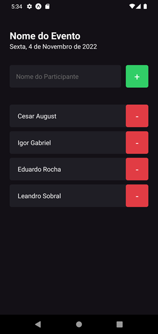

# 🚀 I’m Here – React Native (Rocketseat)

Projeto desenvolvido como parte do **Projeto 1** da trilha de **React Native** na plataforma [Rocketseat](https://www.rocketseat.com.br/).  
O objetivo é criar uma aplicação simples focada em conceitos básicos do **React Native** utilizando o **Expo**.

## 📁 **Criação do Projeto**
Para iniciar o projeto foi utilizado o seguinte comando:
```
npx create-expo-app igniteimhere --template
```

## 📦 **Instalação**
Antes de executar o projeto, instale as dependências necessárias com:
```
npm install
```

## ▶️ **Execução**
Após a instalação, inicie o projeto utilizando:
```
npx expo start
```

## 📸 **Pré-visualização do App**

Confira abaixo algumas capturas de tela do aplicativo em funcionamento:

 
*Tela inicial do aplicativo com o campo de entrada e a lista de participantes vazia.*

  
*Tela inicial do aplicativo com o campo de entrada e a lista de participantes preenchida.*

O comando abrirá o **Expo DevTools** no navegador.  
Você pode rodar o app em um emulador ou escanear o QR code com o app **Expo Go** no celular.

## 🛠️ **Tecnologias & Conceitos Aplicados**
- **📱 Componentes Básicos**
  - View, Text, TextInput, TouchableOpacity, StatusBar  
- **🎨 Estilização**  
  - Utilização de StyleSheet para criar estilos organizados e reutilizáveis  
- **📋 Listas**  
  - Implementação de listas dinâmicas utilizando FlatList  
- **⚡ Feedbacks Visuais**  
  - Uso de Alert para interações rápidas com o usuário  
- **💡 Hooks**  
  - Gerenciamento de estados com useState  

## 📖 **Objetivo do Projeto**
Desenvolver uma aplicação simples que permite adicionar e remover participantes de um evento, utilizando listas dinâmicas, interações básicas e estilização responsiva.

## 💡 **Sobre o Curso**
Projeto guiado pela trilha de **React Native** da Rocketseat, focado em introduzir conceitos essenciais do desenvolvimento mobile com **Expo**.

---

Feito com ❤️ por [Cesar August](https://github.com/CesarAugst)